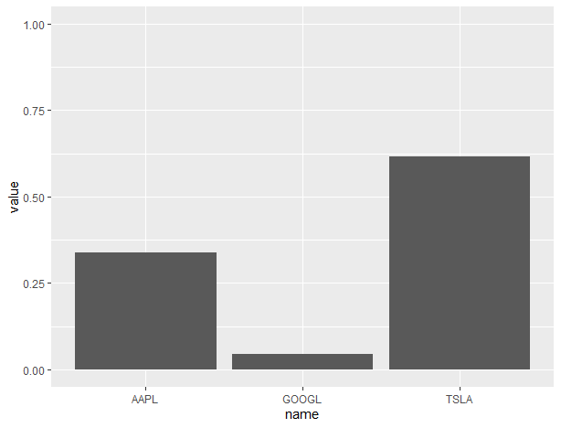

# Portfolio Optimizer 
## Design Principles

This project focuses on four main aspects when designing the structure for this proof of concept:

- Ease of use
- Modularity
- Scalability
- Readibility

Even at this early stage the package contains a .rd documentation file and the main functionality is available from just one intuitive function. This guarantees a good user experience.

The rest of the points are aimed towards a good backend experience. The file and logic organization splits the code into coherent sets that are ready to be used in different contexts. 

The code is well documented and commented. Together with the organization of the code it makes the readibility of the code great.

Scalability really comes into effect when implementing the solvers because they can be computationally very complex. At this stage of the code it's important to pay attention to what data structures are appropriate.

## Paradigm

Chapman & Hall wrote in the [Advanced R](https://adv-r.hadley.nz/oo.html) book:

> Generally in R, functional programming is much more important than object-oriented programming, because you typically solve complex problems by decomposing them into simple functions, not simple objects.--

A software library like this focuses on complex tasks rather than complex structure and thus benefits from a more functional approach.

## Structure

The main function is broken down into three tasks:

- Testing/Prepping the data
- Optimizing the portfolio
- Reporting the results

All of these tasks are done in separate functions. Prepping and reporting defined in one file _util.R_ and the optimizing in another _opt_methods.R_. The method is given as a keyword argument. The target parameter(and future parameters) is also given as a keyword. 

This allows for a couple of things:

- New methods are easy to add
- Custom limitations and restrictions can freely be added and passed to functions that need them.
- Changing the reporting of results and demands of data is easy


## Early Stage Results

```
the securities and weights:
   name      value
1  AAPL 0.05010011
2  TSLA 0.58276016
3 GOOGL 0.36713974
```
This is how the results are presented at this early stage.The input data is simply the names of the securities and the results are generated using a uniform distribution at random. 

## Setup

There is an `install_github` function to install R packages hosted on GitHub in the devtools package. It requests developer’s name.

```
install_github("snuson/optimizer")
```

## License

MIT


